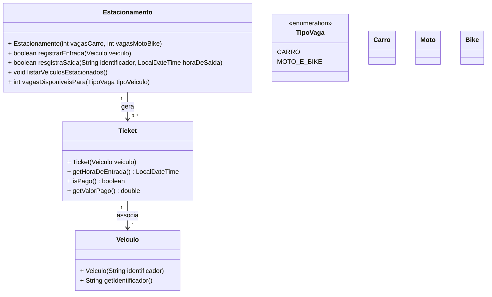

# :parking: Sistema de Gerenciamento de Estacionamento com Herança

---


<a href="https://www.vecteezy.com/free-vector/parking">Fonte: Parking Vectors by Vecteezy</a>

Você foi contratado para desenvolver um Sistema de Gerenciamento de Estacionamento que registra a entrada e saída de veículos, calcula o valor a ser pago pelo tempo de permanência, e armazena informações importantes sobre os tickets emitidos.

O estacionamento possui vagas separadas para carros e para motos/bikes. Ao entrar no estacionamento, o veículo recebe um ticket, que contém informações sobre o horário de entrada, o horário de saída e o valor pago. O ticket é gerado automaticamente ao registrar a entrada do veículo.

Cada tipo de veículo tem uma forma diferente de calcular o valor a pagar, que depende do tempo de permanência no estacionamento.

## 🎯 Requisitos Funcionais


### ✅ Registrar Entrada de Veículo

1. O sistema deve permitir a entrada de veículos, gerando um ticket associado ao veículo.
2. Cada veículo deve ser registrado com o seu identificador único, a placa.
3. O sistema deve verificar se há vagas disponíveis para o tipo de veículo:
   - Carro ocupa uma vaga de carro.
   - Moto e bike ocupam uma vaga de moto/bike.
4. Caso não haja vaga disponível para o tipo de veículo, a entrada deve ser recusada. Nesse caso, o sistema deve exibir uma mensagem indicando que o veículo não pode ser registrado devido à falta de vagas.

---

### ✅ Registrar Saída de Veículo e Pagar o Ticket

1. O sistema deve permitir que um veículo saia do estacionamento.
2. Ao pagar o ticket:
   1. O horário de saída é registrado.
   2. O sistema calcula o valor a ser pago, com base no tempo de permanência.
   3. O ticket é marcado como pago.

---

### ✅ Calcular Valor a Pagar
Cada tipo de veículo tem sua própria regra de cálculo:

| Tipo de Veículo | 	Regra de Cálculo           | Valor Mínimo |
|---|-----------------------------|--------------|
|Carro	| R$ 0,10 por minuto          | 	R$ 5,00     |
|Moto	| R$ 0,05 por minuto | 	R$ 3,00     |
|Bike	|Valor fixo de R$ 3,00|	R$ 3,00 |

---

### ✅ Obter Lista de Veículos Estacionados

1. O sistema deve ser capaz de fornecer uma lista de todos os veículos que estão atualmente estacionados.
2. Para cada veículo, exibir:
   - Identificador (placa)
   - Tipo de veículo
   - Horário de entrada
   - Status do pagamento do ticket (pago ou não).

---


## 🧱 Diagrama



## Exemplo de uso

```java
// Registrar entrada de veículos
estacionamento.registrarEntrada(new Carro("ABC-1234")); // OK
estacionamento.registrarEntrada(new Moto("XYZ-9876"));  // OK

// Tentar registrar mais veículos do que o limite de vagas
        for (int i = 0; i < 6; i++) {
        estacionamento.registrarEntrada(new Carro("CARRO-" + i));
        }
// Saída esperada: "Vaga indisponível para o tipo de veículo Carro."

// Pagar ticket
estacionamento.registrarSaida("ABC-1234", LocalDateTime.now());
```
